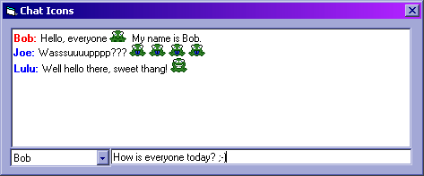



## Add Images to Rich Textbox Controls

### Description

I wanted a simple chatroom for a project I was doing.. and not just something dull and boring, but something that'd be fun. Something with... icons!! So after searching high and low for a way to make it possible, I came up with a fast and easy way to make it possible. Through the SendMessage API call and the WM_PASTE constant, I can quickly put any image I want into my Chatroom (a Microsoft RichTextbox control). I've also developed a way to make use of each images .Tag property to not only hold the character combination that activates the image, but to hold multiple ones! Now, whether the person likes :), :-), :o), :smile: or ... just about anything, they can all activate the same image! Included in this project is a frmReadme that will help familiarize you with how it all works. Please leave your feedback and votes to let me know what you think. If you don't like it, that's fine, just give me some reasons why so I can improve it to fit your tastes, okay? Happy Coding!
 
### More Info
 

             |
---                |---
**Submitted On**   |2002-07-30 11:08:54
**By**             |[Michael Drotar](https://github.com/Planet-Source-Code/PSCIndex/blob/master/ByAuthor/michael-drotar.md)
**Level**          |Beginner
**User Rating**    |4.8 (67 globes from 14 users)
**Compatibility**  |VB 4\.0 \(32\-bit\), VB 5\.0, VB 6\.0
**Category**       |[Graphics](https://github.com/Planet-Source-Code/PSCIndex/blob/master/ByCategory/graphics__1-46.md)
**World**          |[Visual Basic](https://github.com/Planet-Source-Code/PSCIndex/blob/master/ByWorld/visual-basic.md)
**Archive File**   |[Add\_Images1125107302002\.zip](https://github.com/Planet-Source-Code/michael-drotar-add-images-to-rich-textbox-controls__1-37001/archive/master.zip)

